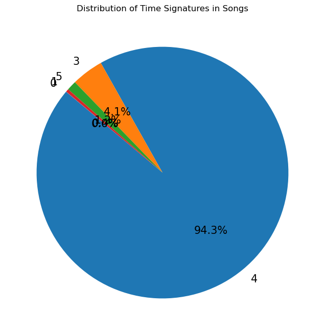

---

| title | description | keywords | date | weight | aliases |
|-------|-------|-------|-------|-------|-------|
Principles of Data Visualization in Practice | In Data analysis it is inherent to visualize data. Learn the most common practices and principles of data visualization | data, visualization, analysis | 2023-08-25 | 9 | learn/guidelines-to-good-visualization

---

## OVERVIEW DATA VISUALIZATION

Data visualization is a form of interpreting information by combining images such as charts, and graphs, with text. It has gained popularity across the scientific literature which helps with useful insights into data. This is beneficial to quickly and effectively convey information

Generally, the purpose of visualization is to convey answers to concrete questions (like the distribution of values in a dataset or what is the maximum, minimum, or outlier values in a dataset) about a given problem and facts about a given problem we were not aware of. This is imperative as we will be able to extract an accurate understanding and interpretation of data.

There is no singular best way of displaying information and this write up will talk about some of the principles to consider and best practices 

### LOADING DATA AND PACKAGES

{}

```python
import pandas as pd  # Data processing, CSV file I/O (e.g. pd.read_csv)
import numpy as np  # Linear algebra
import matplotlib.pyplot as plt  # Data visualization 
import seaborn as sns  # Data visualization and statistical graphics

#LOADING DATA
song_data = pd.read_csv('song_data-Copy1.csv')

```

{}

### Principles Of Good Data Visualization

#### 1 - HAVING A CLEAR PICTURE

Before creating a visualization, it's important to think about the fundamental message you want to convey and the purpose of the visual. Are you aiming to compare items, rank them, or achieve some other goal? This can be done mentally. Additionally, saving figures in scientific publications is valuable because it allows you to develop a keen sense for detail and technical skills that can enhance the quality of your visuals.


{}

**This is a tip.**

##### TABLES

Usually the first step into any exploratory data analysis is to view the tables to get an overview of the structure and type of data you are dealing with as they display summarized values and can be effective in referencing exact information. Tables are not often considered data visualization because they only include alpha-numeric information and no geometries or other visual elements. 
Despite the reluctance to consider tables as data visualization they are useful as they are best suited for looking up specific information.

{}

{}

```python
# Table showing the rows and columns in the dataset
song_data
```

{}


```python

```


<div>
<style scoped>
    .dataframe tbody tr th:only-of-type {
        vertical-align: middle;
    }

    .dataframe tbody tr th {
        vertical-align: top;
    }

    .dataframe thead th {
        text-align: right;
    }
</style>
<table border="1" class="dataframe">
  <thead>
    <tr style="text-align: right;">
      <th></th>
      <th>song_name</th>
      <th>song_popularity</th>
      <th>song_duration_ms</th>
      <th>acousticness</th>
      <th>danceability</th>
      <th>energy</th>
      <th>instrumentalness</th>
      <th>key</th>
      <th>liveness</th>
      <th>loudness</th>
      <th>audio_mode</th>
      <th>speechiness</th>
      <th>tempo</th>
      <th>time_signature</th>
      <th>audio_valence</th>
    </tr>
  </thead>
  <tbody>
    <tr>
      <th>0</th>
      <td>Boulevard of Broken Dreams</td>
      <td>73</td>
      <td>262333</td>
      <td>0.005520</td>
      <td>0.496</td>
      <td>0.682</td>
      <td>0.000029</td>
      <td>8</td>
      <td>0.0589</td>
      <td>-4.095</td>
      <td>1</td>
      <td>0.0294</td>
      <td>167.060</td>
      <td>4</td>
      <td>0.474</td>
    </tr>
    <tr>
      <th>1</th>
      <td>In The End</td>
      <td>66</td>
      <td>216933</td>
      <td>0.010300</td>
      <td>0.542</td>
      <td>0.853</td>
      <td>0.000000</td>
      <td>3</td>
      <td>0.1080</td>
      <td>-6.407</td>
      <td>0</td>
      <td>0.0498</td>
      <td>105.256</td>
      <td>4</td>
      <td>0.370</td>
    </tr>
    <tr>
      <th>2</th>
      <td>Seven Nation Army</td>
      <td>76</td>
      <td>231733</td>
      <td>0.008170</td>
      <td>0.737</td>
      <td>0.463</td>
      <td>0.447000</td>
      <td>0</td>
      <td>0.2550</td>
      <td>-7.828</td>
      <td>1</td>
      <td>0.0792</td>
      <td>123.881</td>
      <td>4</td>
      <td>0.324</td>
    </tr>
    <tr>
      <th>3</th>
      <td>By The Way</td>
      <td>74</td>
      <td>216933</td>
      <td>0.026400</td>
      <td>0.451</td>
      <td>0.970</td>
      <td>0.003550</td>
      <td>0</td>
      <td>0.1020</td>
      <td>-4.938</td>
      <td>1</td>
      <td>0.1070</td>
      <td>122.444</td>
      <td>4</td>
      <td>0.198</td>
    </tr>
    <tr>
      <th>4</th>
      <td>How You Remind Me</td>
      <td>56</td>
      <td>223826</td>
      <td>0.000954</td>
      <td>0.447</td>
      <td>0.766</td>
      <td>0.000000</td>
      <td>10</td>
      <td>0.1130</td>
      <td>-5.065</td>
      <td>1</td>
      <td>0.0313</td>
      <td>172.011</td>
      <td>4</td>
      <td>0.574</td>
    </tr>
    <tr>
      <th>...</th>
      <td>...</td>
      <td>...</td>
      <td>...</td>
      <td>...</td>
      <td>...</td>
      <td>...</td>
      <td>...</td>
      <td>...</td>
      <td>...</td>
      <td>...</td>
      <td>...</td>
      <td>...</td>
      <td>...</td>
      <td>...</td>
      <td>...</td>
    </tr>
    <tr>
      <th>18830</th>
      <td>Let It Breathe</td>
      <td>60</td>
      <td>159645</td>
      <td>0.893000</td>
      <td>0.500</td>
      <td>0.151</td>
      <td>0.000065</td>
      <td>11</td>
      <td>0.1110</td>
      <td>-16.107</td>
      <td>1</td>
      <td>0.0348</td>
      <td>113.969</td>
      <td>4</td>
      <td>0.300</td>
    </tr>
    <tr>
      <th>18831</th>
      <td>Answers</td>
      <td>60</td>
      <td>205666</td>
      <td>0.765000</td>
      <td>0.495</td>
      <td>0.161</td>
      <td>0.000001</td>
      <td>11</td>
      <td>0.1050</td>
      <td>-14.078</td>
      <td>0</td>
      <td>0.0301</td>
      <td>94.286</td>
      <td>4</td>
      <td>0.265</td>
    </tr>
    <tr>
      <th>18832</th>
      <td>Sudden Love (Acoustic)</td>
      <td>23</td>
      <td>182211</td>
      <td>0.847000</td>
      <td>0.719</td>
      <td>0.325</td>
      <td>0.000000</td>
      <td>0</td>
      <td>0.1250</td>
      <td>-12.222</td>
      <td>1</td>
      <td>0.0355</td>
      <td>130.534</td>
      <td>4</td>
      <td>0.286</td>
    </tr>
    <tr>
      <th>18833</th>
      <td>Gentle on My Mind</td>
      <td>55</td>
      <td>352280</td>
      <td>0.945000</td>
      <td>0.488</td>
      <td>0.326</td>
      <td>0.015700</td>
      <td>3</td>
      <td>0.1190</td>
      <td>-12.020</td>
      <td>1</td>
      <td>0.0328</td>
      <td>106.063</td>
      <td>4</td>
      <td>0.323</td>
    </tr>
    <tr>
      <th>18834</th>
      <td>Up to Me</td>
      <td>60</td>
      <td>193533</td>
      <td>0.911000</td>
      <td>0.640</td>
      <td>0.381</td>
      <td>0.000254</td>
      <td>4</td>
      <td>0.1040</td>
      <td>-11.790</td>
      <td>1</td>
      <td>0.0302</td>
      <td>91.490</td>
      <td>4</td>
      <td>0.581</td>
    </tr>
  </tbody>
</table>
<p>18835 rows × 15 columns</p>
</div>


#### 2 - USE THE RIGHT SOFTWARE

Typically, it is recommended to have a good command of the right software for effective visuals, since it is not expected for a spreadsheet program to produce complex figures as it is not designed for such. Here we are using python libraries like Pandas, Matplotlib, Seaborn interchangeably. The technicalities of the codes used will not be discussed in full as that is not the focus of this write up and will encourage you to check out their specific online documentation for more details.

While it is beneficial that most visualization softwares are ready available, inexpensive or free and may come with large online help resources(documentation), it is then up to you to expand your knowledge on these softwares.

#### 3 - EFFECTIVE GEOMETRY

Geometry refers to the shape or form of the visual elements used in data representation. For instance, when you use bar geometry, you create a bar plot. Geometry encompasses various ways of presenting data, and there are multiple options to choose from when visualizing data.

It is recommended to show data in a way that does not detract from the geometry but provides context for the geometry. Although the data provides core information yet in some figures the data can be neglected because of its simplicity.

These geometries can be grouped into categories. It's worth noting that a single geometry can fall into more than one category, and you can visualize a dataset using multiple geometries. We will primarily focus on the most commonly used geometries.

**Amounts(comparison)** geometries should only be used when the data do not have distributional information or uncertainty associated with them. Bar plots are effective for displaying counts of items. However, they are not well-suited for representing grouped data.

***Barplot***

Below is a barplot of the time signature of the songs in the dataset. Time signature denotes the amount of beat per bar and the figure below shows why using a barplot can be disadvantageous as part of the range covered by the bar might not be observed. 

{}

```python 
# The pandas library uses the .plot to display figures and The kind method tells us the type of plot(figure) to be displayed
song_data['time_signature'].value_counts().plot(kind='bar')
```

{}


```python

```


    <AxesSubplot:>


    

    


**Compositions(proportions)** geometries may take a wide range of geometries and traditionally the pie chart is an option but have been shunned for its difficulty in portraying visual comparison. The pie chart has no axes with a round structure. Mosaic plots and tree maps are alternatives.

***Pie chart (mosaic plot / tree maps)***

In addition, showing the data as a percentage instead of numerical values may complicate the analysis. So, it makes more sense to work on datasets with few categories when using a pie chart.
A display of the time signature in percentage is shown below.

{}

```python
# The .value_counts() gives you a Series with the counts of each unique time signature.
# You create a new figure with a specific size by using plt.figure()
# The matplotlib's plt.pie() function creates the pie chart based on the provided data and parameters

time_signature_count = song_data['time_signature'].value_counts()

plt.figure(figsize=(8, 8))
plt.pie(time_signature_count.values, labels=time_signature_count.index, autopct='%1.1f%%', startangle=140, textprops={"fontsize": 15})

# Add title
plt.title("Distribution of Time Signatures in Songs")

plt.show()
```

{}


```python

```


    

    


**Distributions(relationships)** geometries demostrate high density data and the most common geometry used in this are the box plot, histogram, violin plot.

***Histograms***

A histogram is a graph applied to data broken down into numerically ordered groups. Each bin represents a particular group and its height is proportional to the frequency. They show a univariate distribution and are widely used for representing numeric data. This way we can be able to see the shape of the distribution. 

One uses a histogram to learn the spread of values and their scale (are they measured in tens? or hundreds? or millions?), and to understand the mode of the data (the most frequently occurring value).

Let's first plot the 'Danceability' feature, which describes how danceable a song is.

{}

```python
# The bins parameter regulates the number of bins(numerically ordered groups in data)
song_data.plot(y = 'danceability', kind = 'hist', bins = 15)  
```

{}


```python
song_data.plot(y = 'danceability', kind = 'hist', bins = 15)
```


    <AxesSubplot:ylabel='Frequency'>


    

    


***Boxplots***

Boxplot is a plot that shows the univariate distribution and is typically used for exploratory analysis and shows 5 types of info in one object: minimum, first quartile, second quartile (median), third quartile, and maximum.
This kind of plot is useful to learn and compare the centers of the features (mean and median), and to identify the outliers. Here is the scheme, which describes how it works.

To understand it better, let's look at how they are calculated. We take all the values in our array (running distances in our example) and sort them from smallest to largest. Then we divide this list into four equal parts; the points where we divide are the quartiles: the first quartile (Q1) denotes the first 25% of data, the second quartile (Q2, a median) – 50%, and the third (Q3) – 75%. Next, we calculate the interquartile range (IQR) – the difference between the third and first quartiles. Now, we can calculate minimum and maximum values. Minimum is Q1 – 1.5 * IQR and maximum is Q3 + 1.5 * IQR. All data points falling outside the range of minimum and maximum are outliers.

{}

```python
# showmeans=True is an optional parameter that, when set to True, displays the mean value as a point in the box plot. 
# This can provide additional information about the central tendency of the data.
song_data.plot(y=['song_popularity'], kind='box', showmeans=True)
```

{}

As seen there are no outliers here because all songs available fall within the popularity range 0 - 100


```python

```


    <AxesSubplot:>


    

    


***Scatter plot***

Scatterplot is typically used in the analysis of bivariate distribution and shows the relationship between 2 numeric variables plotting individual values as dots. The common practice is to put the explanatory variable on the x axis and the response variable on the y axis

{}

```python
# Create a scatter plot
plt.scatter(x=song_data['energy'], y=song_data['acousticness'], s=15, color='white', edgecolor='tab:blue')

# Add labels and title
plt.xlabel('Energy')
plt.ylabel('Acousticness')
plt.title('Relationship between Energy and Acousticness')

plt.show()
```

{}


```python

```


    

    


#### 4 - Colors

The use of colors in visual presentations can be highly impactful because colorful visuals tend to be more memorable. However, it's important to use colors intentionally.

Colors convey information directly or indirectly and can be categorized into three schemes: sequential, diverging, and qualitative.

**Sequential** color schemes progress from light to dark, usually in one or two hues. They are commonly used to represent increasing values.

{}
```python
# Create a sequential colormap from 'viridis'
cmap = plt.get_cmap('viridis')

# Create the histogram data
hist_data, bin_edges = np.histogram(song_data['danceability'], bins=15)

# Create a figure and axis
fig, ax = plt.subplots()

# Calculate color values for the bars
color_values = np.linspace(0, 1, len(hist_data))

# Create the bar plot with a sequential color scheme
ax.bar(
    bin_edges[:-1],
    hist_data,
    width=np.diff(bin_edges),
    color=cmap(color_values)
)

# Add labels and title
ax.set_xlabel('Danceability')
ax.set_ylabel('Frequency')
ax.set_title('Danceability Histogram with Sequential Color Scheme')

plt.show()

```
{}


```python

```


    

    


**Diverging** color schemes consist of two sequential schemes that highlight two extremes, often with a neutral color in between.

{}
```python
# Create a diverging colormap from 'coolwarm'
cmap = plt.get_cmap('coolwarm')

# Create the histogram
ax = song_data['danceability'].plot(kind='hist', bins=15)

# Calculate the bin edges
hist, bin_edges = np.histogram(song_data['danceability'], bins=15)

# Calculate the bin centers
bin_centers = 0.5 * (bin_edges[1:] + bin_edges[:-1])

# Assign colors to the bins based on a diverging colormap
bin_colors = cmap((bin_centers - bin_centers.min()) / (bin_centers.max() - bin_centers.min()))

# Set the color of each bar
for patch, color in zip(ax.patches, bin_colors):
    patch.set_facecolor(color)

# Add labels and title
ax.set_xlabel('Danceability')
ax.set_ylabel('Frequency')
ax.set_title('Danceability Histogram with Diverging Color Scheme')

plt.show()
```
{}


```python

```


    

    


**Qualitative** colors are employed when the exact intensity of color is less important. Instead, the focus is on using different colors to indicate qualitative group differences.

{}
```python
# Choose a qualitative colormap
cmap = plt.get_cmap("Dark2")
values = song_data['danceability']
num_bins = 15

# Calculate bin edges
bin_edges = np.linspace(values.min(), values.max(), num_bins + 1)

# Assign colors based on bin index
bin_colors = [cmap(i / num_bins) for i in range(num_bins)]

# Create a figure and axis
fig, ax = plt.subplots()

# Plot data in bins with assigned colors
for i in range(num_bins):
    bin_data = values[(values >= bin_edges[i]) & (values <= bin_edges[i + 1])]
    ax.hist(bin_data, bins=bin_edges, color=bin_colors[i], alpha=0.7, label=f'Bin {i+1}')

# Add titles and labels
ax.set_title('Danceability Histogram with Qualitative Color Scheme')
ax.set_xlabel('Danceability',fontsize=16)
ax.set_ylabel('Frequency',fontsize=16)

# Show the plot
plt.show()
```
{}

Some technical considerations when using colors include:

Designing color figures that work well in both color and black-and-white formats whenever possible. This ensures that information remains clear when converted to grayscale.

Combining colors with symbols, line types, and other design elements to convey the same information originally represented by color.

It is good practice to use color schemes that are effective for color-blind readers.

Remember that color is often the first visual cue readers encounter, so it should be strategically employed to enhance the message conveyed by your visuals.


```python

```


    

    


#### 5 - Include Uncertainty

Uncertainty is a vital aspect of understanding most systems. Failing to represent it in visuals can mislead. Two key challenges with visualizing uncertainty are not including it and misrepresenting it.

Often, figures omit uncertainty, leaving gaps in the statistical message, potentially raising doubts about other aspects like mean inference. Including uncertainty is usually straightforward using common features like error bars or shaded intervals.

You can visualize uncertainty either implicitly within existing geometries (e.g., box plots as seen above) or explicitly as separate geometries (e.g., error bars).

Expressing uncertainty is essential, but so is interpreting it correctly. For instance, the mere presence of error bars doesn't guarantee significance; interpretation matters. Some even advise against using standard error due to its limitations. If possible, show the data, especially with small sample sizes, to avoid misinterpretations.


#### 6 - Paneling

An effective visual technique is to use small multiples, which involves repeating a figure to emphasize differences. This approach, also known as paneling or faceting, aims to enhance comparisons by keeping design elements consistent across panels. Each panel typically represents a variation in one variable, such as time, groups, or factors, ensuring that data comparisons are clear and straightforward. 


{}

```python
# This histogram displays the numeric variations of all features within the dataset
song_data.hist(figsize = (20, 10) )
```

{}


```python

```


    array([[<AxesSubplot:title={'center':'song_popularity'}>,
            <AxesSubplot:title={'center':'song_duration_ms'}>,
            <AxesSubplot:title={'center':'acousticness'}>,
            <AxesSubplot:title={'center':'danceability'}>],
           [<AxesSubplot:title={'center':'energy'}>,
            <AxesSubplot:title={'center':'instrumentalness'}>,
            <AxesSubplot:title={'center':'key'}>,
            <AxesSubplot:title={'center':'liveness'}>],
           [<AxesSubplot:title={'center':'loudness'}>,
            <AxesSubplot:title={'center':'audio_mode'}>,
            <AxesSubplot:title={'center':'speechiness'}>,
            <AxesSubplot:title={'center':'tempo'}>],
           [<AxesSubplot:title={'center':'time_signature'}>,
            <AxesSubplot:title={'center':'audio_valence'}>, <AxesSubplot:>,
            <AxesSubplot:>]], dtype=object)


    

    


#### 7 - Detailed captions

It is vital to provide comprehensive captions that thoroughly clarify the content within the figure. A study conducted on figures in the Journal of American Medicine revealed that over one-third of graphs lacked self-explanatory qualities.

Captions should be self-sufficient. This means that if the figure and its caption were examined independently from the rest of the study, the primary message(s) should still be clear. While it's acknowledged that some statistical models and procedures may require more than just a caption for explanation, the fundamental principle remains that captions should make every effort to expound on the visualization and representations used.

For example, even in a simple scatterplot, it should explicitly state that the black dots represent the data. Box plots also demand descriptions of their structure. While certain aspects of a box plot might be assumed, not all box plot symbols are universally understood. The scatter plot below shows the relationship between the energy and acousticness feature of a song.

{}

```python
# Create a scatter plot
plt.scatter(x=song_data['energy'], y=song_data['acousticness'], s=15, color='white', edgecolor='tab:blue')

# Add labels and title
plt.xlabel('Energy')
plt.ylabel('Acousticness')
plt.title('Relationship between Energy and Acousticness')

# Add a caption
plt.annotate('As energy increases, acousticness tends to decrease.', xy=(0.7, 0.3), xytext=(0.7, 0.5),
             arrowprops=dict(facecolor='black', shrink=0.05),
             )

plt.show()

# In this code, we've added the plt.annotate() function to include a caption. 
# You can customize the caption text and its position (xy and xytext) 
# To best describe the relationship between 'energy' and 'acousticness' in your specific data.
```

{}

As you can see, you clearly get an idea of the scatter plot just from a good descriptive caption.


```python

```


    

    


#### 8 - Get an opinion

While there are principles and theories about effective data visualization, the truth is that the most effective visuals are the ones that resonate with readers. Therefore, authors are encouraged to have external reviewers assess their figures. Often, figures are created hastily during the writing process and are not objectively reviewed.

Getting colleagues or external individuals to review your figures can offer valuable feedback on what readers find effective or not. It's also advisable to have these reviewers focus solely on the figures. This not only saves time but allows them to provide feedback exclusively on the visuals without the context of the accompanying text.

{}

Figures in scientific publications are not just an additional element but can be pivotal in the scientific process. They serve as a means for figure creators to showcase their understanding and communication of data and results. Figures are often one of the first points of reference for new readers seeking to grasp the information. In reality, the success of most figures hinges on their ability to convey the message within seconds. The longer it takes for someone to comprehend the message from a figure, the less likely they are to benefit from it, and it may even hinder their understanding of the broader work. Adhering to a set of guidelines and recommendations, summarized here and drawing from others, can assist in creating robust visuals that avoid common pitfalls seen in ineffective figures 

However, due to the subjective nature of design elements, it's challenging to envision strict visual guidelines being universally enforced across scientific domains. In the absence of such guidelines and considering the multitude of design choices available to figure authors, it remains crucial for a set of aesthetic criteria to emerge to facilitate the efficient communication of visual information

{}


```python

```


```python

```


```python

```


```python

```


```python

```


```python

```


```python

```


```python

```


```python

```


```python

```


```python

```


```python

```


```python

```
